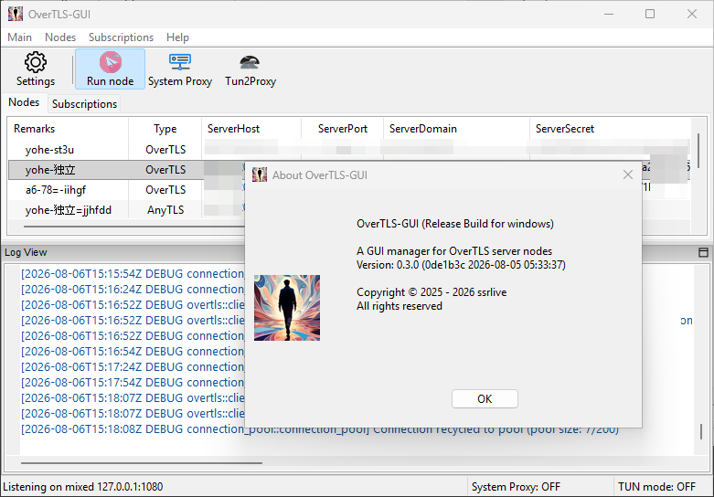
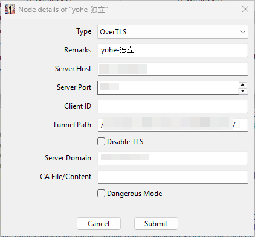
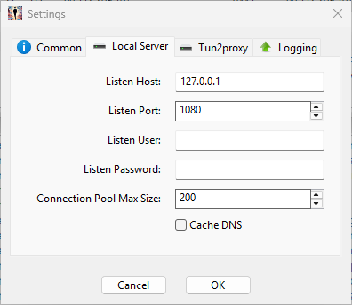

# OverTLS GUI

[中文版 README](README-CN.md)

OverTLS GUI is a Rust desktop application built with `wxDragon` to provide a graphical
management interface for [OverTLS](https://github.com/ShadowsocksR-Live/OverTLS) proxy nodes.
It enables subscription-based node management, QR code import/export, logging, and system tray integration
on Linux, Windows, and macOS.

## Highlights

- **Node Management**: add, edit, delete, and inspect OverTLS server nodes.
- **Subscription Support**: manage subscription URLs, refresh subscription feeds, and merge nodes without duplicates.
- **Automatic Refresh**: toggleable `Refresh automatically` menu item with configurable refresh interval.
- **QR Code Support**: scan QR codes from screen capture and display node QR codes.
- **Settings Dialog**: configure OverTLS, Tun2proxy, logging, and subscription refresh interval.
- **System Tray**: minimize to tray, restore the window, and access settings from the tray menu.
- **Privilege Handling**: detect admin/root status and restart elevated when required on Linux.
- **Logging**: integrated log capture with configurable log settings.

## Screenshots







## Installation & Build

### Requirements

- Rust 1.85+
- `cargo` toolchain
- Native GUI dependencies for `wxDragon`

### Linux Dependencies

On Debian/Ubuntu, install the common native packages required to build the GUI:

```bash
sudo apt-get update
sudo apt-get install --fix-missing -y libxmu-dev \
  libx11-dev libxext-dev libxft-dev libxinerama-dev libxcursor-dev libxrender-dev libxfixes-dev \
  libpango1.0-dev libgl1-mesa-dev libglu1-mesa-dev libgdk-pixbuf2.0-dev libgtk-3-dev libxdo-dev
```

### Build

```bash
cargo build --release
```

### Run

```bash
./target/release/overtls-gui
```

### Optional Bundles

The project contains `cargo-bundle` metadata for packaging on supported platforms.
Example for Linux:

```bash
cargo install cargo-bundle
cargo bundle --release --format deb --target x86_64-unknown-linux-gnu
```

## Usage

- Open `Settings` from the menu or tray to configure OverTLS, Tun2proxy, logging, and subscription refresh.
- Use the `Subscriptions` menu to add, edit, delete, or manually refresh subscription URLs.
- Enable `Refresh automatically` in the `Subscriptions` menu to run periodic background refreshes.
- Configure the refresh interval in minutes via the settings dialog.
- Scan QR codes from the screen using `Scan QR Code` and display node QR codes with `Show QR Code`.
- Use the system tray icon to hide or restore the window and access settings quickly.

## Configuration

- App settings are persisted as JSON in the user configuration path.
- Stored values include window geometry, node list, subscription URLs, refresh interval, and auto-refresh state.
- Subscription refresh results are merged into the node list and saved automatically.

## Development Notes

- Uses `wxDragon` for the GUI frontend.
- Uses `reqwest` for fetching subscription feeds.
- Uses `tun2proxy` support for proxy tunnel integration.
- Uses `serde`/`serde_json` for configuration serialization.
- Background subscription refresh is performed in a worker thread and dispatched back to the main UI thread.

## License

- MIT

---

For more details, inspect the source code and module comments or open an issue in the repository.
