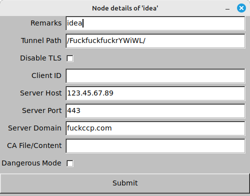

# OverTLS GUI

[中文版 README](README-CN.md)

OverTLS GUI is a cross-platform graphical management tool for
[OverTLS](https://github.com/ShadowsocksR-Live/OverTLS) client nodes, built with Rust and FLTK.
It provides an intuitive interface for configuring, importing, and running OverTLS nodes,
supporting Linux, Windows, and macOS.

## Features

- **Node Management**: Create, import, delete, and view node details.
- **Configuration Import**: Import node configurations from JSON files, clipboard, or by scanning QR codes from the screen.
- **System Settings**: Configure local listening, connection pool, DNS cache, Tun2proxy proxy, and more.
- **Log Viewer**: Real-time log display at the bottom of the main window, with adjustable log levels.
- **System Tray Support**: Minimize to tray, show/hide main window, and quit from tray menu.
- **Privilege Check**: Automatically checks for root/admin privileges on Linux and restarts as administrator if needed.
- **Multi-language Support**: UI text can auto-switch based on system language (if configured).

## Installation & Build


### Dependencies

- [Rust 1.85+](https://www.rust-lang.org/)

#### Additional Linux Build Dependencies

On Linux, you need to install the following system libraries before building (as used in CI):

```bash
sudo apt-get update
sudo apt-get install --fix-missing -y libxmu-dev \
  libx11-dev libxext-dev libxft-dev libxinerama-dev libxcursor-dev libxrender-dev libxfixes-dev \
  libpango1.0-dev libgl1-mesa-dev libglu1-mesa-dev libgdk-pixbuf2.0-dev libgtk-3-dev libxdo-dev
```

### Build

```bash
git clone https://github.com/ShadowsocksR-Live/overtls-gui.git
cd overtls-gui
cargo build --release
```

### Run

On Linux (requires root privileges):

```bash
sudo ./target/release/overtls-gui
```

On Windows/macOS:

```bash
./target/release/overtls-gui
```

## Usage

- Use the menu bar to import nodes (from file, clipboard, or QR code), create new nodes, delete, and view details.
- Click "Settings" to configure local listening, Tun2proxy, logging, and other parameters.
- The tray icon allows you to show/hide the main window or quit the application at any time.
- Node details support custom remarks, tunnel path, TLS, client parameters, and more.

## Configuration

- Supports multi-node management; configuration files are compatible with OverTLS standard.
- Tun2proxy proxy, DNS strategy, logging, and other options can be adjusted in the settings dialog.
- Supports import/export of node configurations for backup and migration.

## Screenshots





## License

- License: MIT

---

For more detailed usage, configuration formats, or FAQs, please refer to the source code comments or submit an issue.
